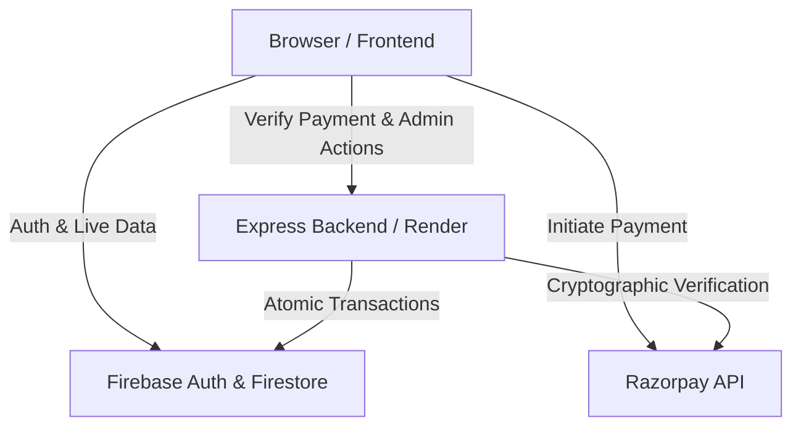

# Architecture Overview

Class Fund Manager utilizes a modern, decoupled architecture designed for scalability, security, and low-cost maintenance.

## High-Level Architecture

The system is split into a static frontend, a lightweight backend for secure operations, and a real-time database.

## 1. Frontend (Firebase Hosting)
- **Tech Stack**: Vanilla HTML, CSS, JavaScript.
- **Role**: Handles the user interface, routing, and direct interactions with Firebase Authentication.
- **Data Flow**: The frontend connects directly to Firestore using the Firebase Web SDK to listen for real-time updates (e.g., balance changes, new transactions). Security rules ensure users can only read data they are authorized to see.

## 2. Backend (Render.com)
- **Tech Stack**: Node.js, Express.
- **Role**: A dedicated environment to hold secrets and perform privileged operations that cannot be trusted to the client browser.
- **Key Responsibilities**:
  - **Order Creation**: Generating Razorpay Order IDs securely.
  - **Signature Verification**: Validating Razorpay webhooks and payment signatures using the `RAZORPAY_KEY_SECRET`.
  - **Accounting**: Handling atomic database transactions (e.g., deducting balances, recording expenses) using the Firebase Admin SDK to bypass standard client-side rules and ensure ledger integrity.
  - **Automated Tasks**: Expiring pending transactions via `setInterval`.

## 3. Database (Cloud Firestore)
- **Tech Stack**: NoSQL Document Database.
- **Role**: Stores all application data.
- **Collections**:
  - `users`: Profiles, roles (student/admin), and total paid amounts.
  - `programs`: Funding goals, targets, and active status.
  - `contributions`: The ledger of all payments (Razorpay, Cash, UPI).
  - `expenses`: The ledger of all money spent from the fund.
- **Security**: Access is governed by `firestore.rules`. Most write operations are locked down and can only be performed by the Backend (which uses the Admin SDK to bypass rules).

## 4. Authentication (Firebase Auth)
- **Tech Stack**: Firebase Authentication (Email/Password).
- **Role**: Manages user identities. 
- **Custom Claims**: Admin users are granted a cryptographic `{ admin: true }` claim on their ID token. This allows both the Frontend and Backend to verify admin privileges instantly without querying the database.

## 5. Payments (Razorpay)
- **Tech Stack**: Razorpay Checkout & API.
- **Role**: Processes digital transactions securely.
- **Flow**:
  1. Frontend requests an Order ID from Backend.
  2. Backend requests Order ID from Razorpay and returns it to Frontend.
  3. Frontend opens Razorpay Checkout UI.
  4. User completes payment.
  5. Razorpay returns a cryptographic signature to Frontend.
  6. Frontend forwards signature to Backend.
  7. Backend verifies signature and updates Firestore ledger.
